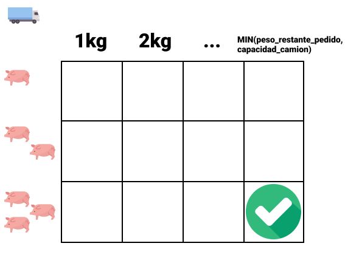

# Trabajo 1 de Bases de Datos 2 - 2021-1 en UNAL_MED

**_Santiago Rendón Giraldo - Juan José Sapuyes_**

## Introducción

Este trabajo está desarollado con  _Oracle Database 11g Express Edition._  Se recomienda utilizar esta versión para la debida revisión. 

**Nota:** Para probar el punto 1, ejecute primero el archivo `create_and_populate_tables_cerdo_and_camion` para crear la tabla cerdos y camiones con los valores de ejemplo. Después de esto, se podrá ejecutar sin problema el archivo `knapsack_cerdos`.
   
**Nota:** Para ejecutar el punto 2, es necesario ejecutar todos los archivos de la carpeta `trigger_fiesta` en el siguiente orden:
1. `create_individuos_and_auxiliary_tables`
2. `individuo_codigo_update_cascade`
3. Aquí ya se puede ejecutar cualquiera de los archivos restantes sin importar su orden. Es necesario ejecutar todos antes de hacer las respectivas pruebas. 

## Punto 1

Para resolver este problema, tomamos cada camión y lo interpretamos como un _0/1 Knapsack Problem_, [ver video](https://www.youtube.com/watch?v=xCbYmUPvc2Q).

Luego de declarar las variables, tomamos todos los cerdos y los camiones en Arrays.

```sql
    select *
        bulk collect
    into trucks
    from camion
    order by MAXIMACAPACIDADKILOS desc;

    select *
        bulk collect
    into pigs
    from cerdo;
```
Una vez tenemos estos arrays, recorremos cada camión y allí generamos la matriz del problema de Knapsack, donde el peso máximo está definido así:

```sql
    select least(trucks(t).MAXIMACAPACIDADKILOS, remaining_weight) into max_weight from dual;
```

Y la cantidad de items son los cerdos disponibles, como podemos ver en la siguiente imagen.



Procedemos a recorrer la matriz, y en cada celda guardamos el peso óptimo dada la restricción del peso máximo (columna) y la cantidad de cerdos disponibles (fila).

Una vez resueltos todos los subproblemas, podemos encontrar el valor óptimo a cargar en dicho camión en la última celda de la matriz. Almacenamos la información de los cerdos cargados, el peso total cargado y el espacio no usado para mostrarlos en el informe.

Repetimos este procedimiento para cada camión, teniendo en cuenta los cerdos que no están disponibles y finalmente computamos los valores totales del informe.


## Punto 2

### A
Creamos un `COMPOUND TRIGGER`, que si bien no es necesario para este punto en específico, nos ayudará a evitar el error `ORA-04091 Mutating Table` más adelante en el literal B.

```sql
CREATE OR REPLACE TRIGGER individuo_insert_compound
    FOR INSERT
    ON INDIVIDUO
    COMPOUND TRIGGER

END individuo_insert_compound;
```
En el punto de tiempo `BEFORE EACH ROW` asignamos 0 al valor de `nro_hijos` así:

```sql
...
COMPOUND TRIGGER
    BEFORE EACH ROW IS
    BEGIN
        :NEW.NRO_HIJOS := 0;
    END BEFORE EACH ROW;
...
```

### B
Dentro del `COMPUND TRIGGER` del punto anterior, y en el mismo punto de tiempo, agregamos a una lista todos los padres que no sean nulos y después, en el `AFTER STATEMENT` hacemos la actualización del padre (aumentando su cantidad de hijos).

```sql
...
AFTER STATEMENT IS
BEGIN
    FOR p IN 1..padres.COUNT
        LOOP
            UPDATE INDIVIDUO SET NRO_HIJOS = NRO_HIJOS + 1 WHERE CODIGO = padres(p);
        END LOOP;
END AFTER STATEMENT;
...
```

### C
Para este punto, también utilizamos un `COMPOUND TRIGGER` disparado por la sentencia `DELETE` y realiza un procedimiento similar al del punto B, pero decrementando la cantidad de hijos. 

### D
Primero dentro del `COMPOUND TRIGGER` del punto anterior, en el `BEFORE STATEMENT` guardamos a todos los individuos en una lista y luego asignamos `NULL` a todos los padres de estos en la tabla. Después en el `BEFORE EACH ROW`, guardamos en una lista a los padres que deben ser borrados y restauramos el resto de padres en el `AFTER STATEMENT`.

### E
Fue necesario para este punto crear la siguiente tabla

```sql
CREATE TABLE auxiliary(
 nombre VARCHAR2(20) PRIMARY KEY,
 valor NUMBER(8)
);

insert into auxiliary (nombre, valor) values ('valor_update_level', 0);
```
Creamos un `COMPOUND TRIGGER FOR UPDATE OF VALOR` y en el `BEFORE STATEMENT`guardamos el valor de `valor_update_level` de la tabla `auxiliary` el cual indica el nivel de recursión del `TRIGGER`. Es importante añadirle la sentencia `FOLLOWS codigo_update_trigger`, ya que importa el tiempo en que se ejecuta cada trigger. 

Después en `BEFORE EACH ROW` verificamos las restricciones impuestas por el punto si el nivel de recursión es menor a 1 (que indica si este `update` fue llamado dentro del mismo `TRIGGER`) y si cumple con estas, se guarda el código del padre si tiene hijos, el restante del valor que debe ser sumado al primer hijo y se suma 2 a la fila actual. 

En el `AFTER STATEMENT` verificamos que el nivel de recursión sea menor a 1, incrementamos este y actualizamos la columna `valor` de los primeros hijos. Finalmente actualizamos el nivel de recursión a 0 en la tabla `auxiliary`.

### F
Creamos un `COMPOUND TRIGGER FOR UPDATE OF CODIGO` y en el `BEFORE STATEMENT` aplicamos un procedimiento similar al del punto D donde guardamos todos los individuos en una lista y hacemos `NULL` a toda la columna `padre`. 

En el `BEFORE EACH ROW` guardamos los códigos viejos y nuevos. Finalmente en el `AFTER STATEMENT` recorremos la lista de individuos guardada previamente y restauramos los valores de `padre` teniendo en cuenta los nuevos valores. 
